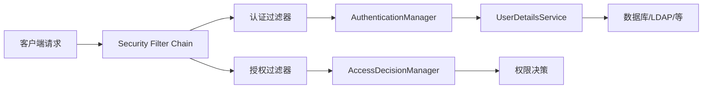
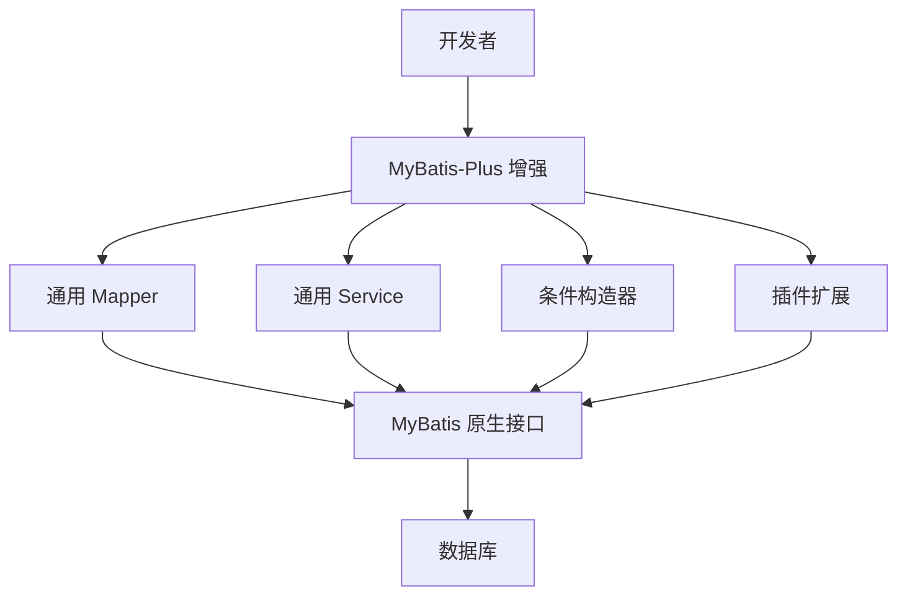

# 项目技术选型

* 前端技术：Vue 3+ axios 
* 后端技术：Spring Boot + Spring Security
* 数据库：MySQL数据库
* 数据层框架：MyBatis Plus
# 前端技术简介
## Vue3 简介

Vue 3 是**渐进式前端框架**的最新正式版本（当前稳定版为 3.4+），于 2020 年发布。它在性能、开发体验和扩展性上全面升级，同时保留 Vue 2 的易用性。

---

### **三大核心亮点**  
1. **🚀 性能飞跃**  
   - 重写**虚拟 DOM**（Diff 算法优化）  
   - 基于 `Proxy` 的**响应式系统**（性能提升 + 支持 Map/Set 等数据结构）  
   - 打包体积减少（Tree-shaking 支持，按需引入）  

2. **🎨 Composition API**  
   - 用 `setup()` 函数替代 `data`/`methods` 等选项，**逻辑更聚合**  
   - 支持灵活复用逻辑（类似 React Hooks）  
   - 例：  
     ```javascript
     import { ref, computed } from 'vue';
     setup() {
       const count = ref(0);
       const double = computed(() => count.value * 2);
       return { count, double };
     }
     ```

3. **🛠 更好的 TypeScript 支持**  
   - 源码用 TypeScript 重写  
   - 提供完整的类型推断  

---

### **其他关键特性**  
- **Fragment**：组件支持多根节点  
- **Teleport**：将组件渲染到 DOM 任意位置（如弹窗）  
- **Suspense**：异步组件加载状态管理  
- **自定义渲染器**：支持非 DOM 环境（如小程序、Canvas）  

---

### **与 Vue 2 的兼容性**  
- 大多数 API 向下兼容，提供迁移工具（`@vue/compat`）  
- 推荐新项目直接用 Vue 3 + Vite 构建工具  

---
## axios简介
**axios** 是一个基于 Promise 的现代化 **HTTP 客户端库**，专为浏览器和 Node.js 设计。它以简洁、灵活的特性成为前端开发中最流行的网络请求工具之一。

---
### **核心特点**  
1. **跨平台支持**  
   - 在浏览器中基于 `XMLHttpRequest` 发起请求  
   - 在 Node.js 中基于 `http` 模块发起请求  

2. **Promise API**  
   - 所有请求返回 Promise 对象，支持 `async/await`，告别回调地狱  
   ```javascript
   async function fetchData() {
     try {
       const response = await axios.get('/api/data');
       console.log(response.data);
     } catch (error) {
       console.error('请求失败', error);
     }
   }
   ```

3. **拦截器机制**  
   - 全局拦截请求和响应（如添加 Token、统一报错处理）  
   ```javascript
   // 请求拦截器
   axios.interceptors.request.use(config => {
     config.headers.Authorization = 'Bearer xxx';
     return config;
   });

   // 响应拦截器
   axios.interceptors.response.use(
     response => response.data, // 直接返回核心数据
     error => { /* 统一处理错误 */ }
   );
   ```

4. **自动转换数据**  
   - 自动将请求数据转换为 JSON（`application/json`）  
   - 自动解析响应 JSON 为 JavaScript 对象  

5. **取消请求**  
   - 使用 `CancelToken` 或 **AbortController** 中止正在进行的请求  
   ```javascript
   const controller = new AbortController();
   axios.get('/api/data', { signal: controller.signal });
   // 取消请求
   controller.abort();
   ```

6. **并发处理**  
   - `axios.all()` + `axios.spread()` 处理并行请求  
   ```javascript
   const [userRes, orderRes] = await axios.all([
     axios.get('/user'),
     axios.get('/orders')
   ]);
   ```

---

### **基础使用示例**  
```javascript
// 发起 GET 请求
axios.get('https://api.example.com/data')
  .then(response => console.log(response.data))
  .catch(error => console.error(error));

// 发起 POST 请求
axios.post('https://api.example.com/save', { name: 'John' })
  .then(res => console.log('保存成功'));
```

---

### **为什么选择 axios？**  
| 特性                | 原生 `fetch`                   | `axios`                      |
|---------------------|-------------------------------|------------------------------|
| **浏览器兼容性**     | 现代浏览器（需 polyfill）      | 广泛支持（包括 IE11）         |
| **请求取消**        | 需手动实现（AbortController） | 内置支持                      |
| **超时设置**        | 不支持                         | 直接配置 `timeout` 参数       |
| **拦截器**          | 无                            | 完整拦截器体系                |
| **请求进度**        | 需手动实现                     | 支持上传/下载进度监听         |

---

### **安装**  
```bash
npm install axios
# 或
yarn add axios
```

---

### **适用场景**  
- Vue/React/Angular 项目中的 API 调用  
- Node.js 后端服务调用第三方接口  
- 需要统一管理 HTTP 逻辑的企业级应用  

# 后端技术简介
## SpringBoot简介
**Spring Boot** 是 Java 领域最流行的**微服务框架**，由 Pivotal 团队开发（基于 Spring 框架）。它通过 **“约定优于配置”** 的设计理念，极大简化了 Spring 应用的初始搭建和开发过程。以下是其核心特点：

### **三大核心价值**  
1. **🚀 快速启动（Standalone）**  
   - **内嵌服务器**（Tomcat/Jetty/Undertow），无需部署 WAR 包  
   - 只需一个 `main` 方法即可启动项目：  
     ```java
     @SpringBootApplication
     public class App {
         public static void main(String[] args) {
             SpringApplication.run(App.class, args); // 一行代码启动服务
         }
     }
     ```

2. **🧩 自动配置（Auto-Configuration）**  
   - 根据项目依赖 **智能装配 Bean**（如引入 `spring-boot-starter-web` 自动配置 MVC）  
   - 通过 `@EnableAutoConfiguration` 激活，避免手动编写 XML 配置  

3. **📦 起步依赖（Starter POMs）**  
   - 预置常用依赖组合（如 `spring-boot-starter-data-jpa` 包含 JPA + Hibernate + 连接池）  
   - 解决传统 Spring 的依赖冲突问题  

---
### **核心特性详解**  
| 特性              | 说明                                                     |
| --------------- | ------------------------------------------------------ |
| **内嵌容器**        | 默认集成 Tomcat（可切换 Jetty/Undertow），无需外部服务器                |
| **Actuator 监控** | 提供 HTTP 端点监控应用状态（健康检查、性能指标、配置信息）                       |
| **外部化配置**       | 支持 `application.yml` 多环境配置（dev/test/prod），优先级灵活覆盖      |
| **生产就绪特性**      | 健康检查、指标收集、审计日志集中管理                                     |
| **简化安全控制**      | 通过 `spring-boot-starter-security` 快速集成 Spring Security |
| **丰富的 Starter** | 覆盖 Web、数据访问、消息队列、缓存等 100+ 官方/第三方 Starter               |

---

### **开发效率对比（Spring Boot vs 传统 Spring）**  
| 任务                 | 传统 Spring                 | Spring Boot                     |
|----------------------|----------------------------|----------------------------------|
| **创建项目**         | 手动配置依赖 + XML          | 选择 Starter（秒级生成）         |
| **启动服务器**       | 需部署到外部 Tomcat         | `main()` 直接运行                |
| **数据源配置**       | 手动定义 Bean + XML         | 自动配置（仅需写 `url`/`密码`）  |
| **监控管理**         | 需额外集成                  | Actuator 开箱即用                |

---
### **典型应用场景**  
1. **RESTful API 服务**（结合 Spring MVC）  
2. **微服务架构**（配合 Spring Cloud）  
3. **批处理任务**（使用 `spring-boot-starter-batch`）  
4. **实时数据处理**（集成 Kafka/RabbitMQ Starter）  

---

### **代码示例：5 分钟创建 REST 接口**  
```java
@RestController
@SpringBootApplication
public class DemoApp {
    public static void main(String[] args) {
        SpringApplication.run(DemoApp.class, args);
    }

    @GetMapping("/hello")
    public String hello() {
        return "Hello Spring Boot!";  // 访问 http://localhost:8080/hello
    }
}
```

---

### **生态与版本**  
- **最新稳定版**：Spring Boot 3.x（需 Java 17+）  
- **长期支持版**：Spring Boot 2.7.x（Java 8+）  
- **开发工具**：  
  - [start.spring.io](https://start.spring.io/)（项目脚手架）  
  - Spring Tools Suite（IDE 插件）  

---

**💡 总结**：  
> Spring Boot 通过 **自动化配置** + **内嵌容器** + **Starter 依赖**，将 Spring 从“配置地狱”中解放出来，使开发者能专注于业务逻辑，成为 Java 微服务开发的**事实标准**。

---
## Spring Security 简介
**Spring Security** 是 Spring 生态中**功能最全面的安全框架**，专为 Java 应用提供**认证（Authentication）** 和 **授权（Authorization）** 能力。它不仅保护 Web 请求，还支持方法级安全、OAuth2、JWT 等现代安全方案，是企业级应用的安全基石。

---

### **核心功能**
| **能力**         | **说明**                                                                 |
|-------------------|--------------------------------------------------------------------------|
| **身份认证**      | 支持表单登录、HTTP Basic、LDAP、OAuth2、JWT 等多种登录方式               |
| **访问控制**      | 基于角色（RBAC）、权限表达式（如 `hasRole('ADMIN')`）控制资源访问        |
| **会话管理**      | 防御会话固定攻击、支持集群会话存储（Redis）                              |
| **CSRF 防护**     | 自动验证请求令牌（默认开启）                                             |
| **CORS 配置**     | 跨域资源共享的安全策略管理                                               |
| **安全头注入**    | 自动添加 `X-Content-Type-Options`、`Strict-Transport-Security` 等安全头  |
| **漏洞防护**      | 防御 XSS、点击劫持、暴力破解等常见攻击                                   |

---

### **核心架构**



1. **过滤器链（Filter Chain）**  
   Spring Security 本质是一组过滤器，按顺序拦截请求（如 `UsernamePasswordAuthenticationFilter` 处理登录）。

2. **认证流程**  
   - 用户提交凭证 → `AuthenticationManager` 调用 `UserDetailsService` 加载用户数据 → 验证密码/状态 → 生成 `Authentication` 对象存入安全上下文。

3. **授权流程**  
   - 访问受限资源时 → `AccessDecisionManager` 根据配置的规则（如 `@PreAuthorize("hasAuthority('WRITE')")`）决定是否放行。

---

### **关键组件**
| **组件**                 | **作用**                                                                 |
|--------------------------|--------------------------------------------------------------------------|
| `SecurityFilterChain`    | 定义安全过滤器链（Spring Boot 自动配置默认链）                           |
| `UserDetailsService`     | 加载用户数据（需自定义实现数据库查询等逻辑）                             |
| `PasswordEncoder`        | 密码加密器（推荐 `BCryptPasswordEncoder`）                               |
| `AuthenticationProvider` | 自定义认证逻辑（如短信登录）                                             |
| `SecurityContextHolder`  | 存储当前用户的安全上下文（默认基于 ThreadLocal）                         |

---

### **集成 Spring Boot 示例**
#### 1. 基础配置
```java
@Configuration
@EnableWebSecurity
public class SecurityConfig {

    @Bean
    public SecurityFilterChain filterChain(HttpSecurity http) throws Exception {
        http
            .authorizeHttpRequests(auth -> auth
                .requestMatchers("/public/**").permitAll()
                .requestMatchers("/admin/**").hasRole("ADMIN")
                .anyRequest().authenticated() // 其他请求需登录
            )
            .formLogin(form -> form
                .loginPage("/login") // 自定义登录页
                .permitAll()
            )
            .logout(logout -> logout
                .logoutSuccessUrl("/")
            );
        return http.build();
    }

    @Bean
    public PasswordEncoder passwordEncoder() {
        return new BCryptPasswordEncoder(); // 密码加密
    }
}
```

#### 2. 自定义用户查询
```java
@Service
public class CustomUserService implements UserDetailsService {

    @Autowired
    private UserRepository userRepo;

    @Override
    public UserDetails loadUserByUsername(String username) {
        User user = userRepo.findByUsername(username);
        if (user == null) throw new UsernameNotFoundException("用户不存在");
        return new org.springframework.security.core.userdetails.User(
            user.getUsername(),
            user.getPassword(),
            AuthorityUtils.createAuthorityList(user.getRoles()) // 角色列表
        );
    }
}
```

---

### **高级特性**
1. **OAuth2 集成**  
   - 快速实现第三方登录（GitHub/Google）或构建自己的授权服务器。
   ```java
   @EnableWebSecurity
   @EnableOAuth2Client // 启用 OAuth2
   public class OAuthConfig extends WebSecurityConfigurerAdapter { ... }
   ```

2. **方法级安全控制**  
   - 在 Service 层使用注解精确控制权限：
   ```java
   @PreAuthorize("hasRole('ADMIN') or #userId == authentication.principal.id")
   public void deleteUser(Long userId) { ... }
   ```

3. **JWT 支持**  
   - 通过过滤器实现无状态 Token 认证（搭配 `jjwt` 库）：
   ```java
   public class JwtFilter extends OncePerRequestFilter {
       @Override
       protected void doFilterInternal(HttpServletRequest request, HttpServletResponse response, FilterChain chain) {
           String token = extractToken(request);
           if (tokenValid(token)) {
               Authentication auth = createAuthentication(token);
               SecurityContextHolder.getContext().setAuthentication(auth);
           }
           chain.doFilter(request, response);
       }
   }
   ```

---
### **适用场景**
- 企业后台管理系统（RBAC 权限控制）
- 微服务 API 安全（JWT + OAuth2）
- 金融/政府等合规性要求高的系统
- 需要 SSO（单点登录）的分布式应用

> 💡 **总结**：  
> Spring Security 通过**可扩展的架构** + **深度 Spring 集成** + **全面的安全防护**，成为 Java 领域事实上的安全标准。其学习曲线较陡，但掌握了核心流程（认证→授权→防护）即可应对多数场景。

---
## MyBatis Plus简介
**MyBatis-Plus（简称 MP）** 是 **MyBatis 的增强工具库**，在 MyBatis 基础上仅做增强不做改变，旨在简化开发、提高效率。它通过内置通用 Mapper 和 Service，实现了单表 CRUD 操作的零 SQL 编写，同时保留 MyBatis 的所有灵活性。以下是其核心特性与价值：

---

### **核心特性概览**
| **特性**                | **说明**                                                                 |
|-------------------------|--------------------------------------------------------------------------|
| **无侵入设计**          | 只做增强，不影响原生 MyBatis 功能                                        |
| **强大的 CRUD 接口**    | 内置 `BaseMapper` + `IService`，单表操作免 SQL                           |
| **Lambda 表达式支持**   | 避免字段硬编码（如 `LambdaQueryWrapper<User>`）                          |
| **自动分页插件**        | 无缝整合 PageHelper，支持多种数据库分页                                  |
| **代码生成器**          | 一键生成 Entity、Mapper、Service、Controller 等全套代码                  |
| **全局拦截器**          | 支持 SQL 性能分析、租户隔离、数据权限控制等扩展                          |
| **多租户支持**          | 通过插件实现数据隔离（基于 Schema 或字段）                               |
| **乐观锁插件**          | 自动处理并发冲突（`@Version` 注解）                                      |

---

### **架构设计**



---

### **基础使用示例**
#### 1. **实体类与 Mapper**
```java
@Data
public class User {  // 实体类
    @TableId(type = IdType.AUTO)  // 主键自增
    private Long id;
    private String name;
    private Integer age;
    private String email;
}

public interface UserMapper extends BaseMapper<User> { }  // 继承通用 Mapper
```

#### 2. **无需 SQL 的 CRUD 操作**
```java
// 插入
User user = new User();
user.setName("张三");
user.setAge(25);
userMapper.insert(user);  // SQL 自动生成: INSERT INTO user (name, age) VALUES (?,?)

// 查询
List<User> users = userMapper.selectList(
    new QueryWrapper<User>().lambda()
        .like(User::getName, "张")  // Lambda 避免字段名硬编码
        .gt(User::getAge, 20)
);
// 生成 SQL: SELECT * FROM user WHERE name LIKE '%张%' AND age > 20

// 分页查询
Page<User> page = new Page<>(1, 10);  // 第1页, 每页10条
Page<User> result = userMapper.selectPage(page, 
    Wrappers.<User>query().orderByDesc("age")
);
```

#### 3. **Service 层封装**
```java
public interface UserService extends IService<User> { }  // 继承通用 Service

@Service
public class UserServiceImpl extends ServiceImpl<UserMapper, User> 
    implements UserService { }  // 实现类

// 使用 Service
userService.saveBatch(userList);  // 批量插入
userService.lambdaUpdate()
    .set(User::getEmail, "update@example.com")
    .eq(User::getAge, 25)
    .update();  // 条件更新
```

---

### **进阶功能**
#### 1. **代码生成器（减少 80% 手写代码）**
```java
AutoGenerator generator = new AutoGenerator();
generator.setDataSource(new DataSourceConfig()
    .setUrl("jdbc:mysql://localhost:3306/test")
    .setUsername("root")
    .setPassword("root")
);

generator.setGlobalConfig(new GlobalConfig()
    .setOutputDir(System.getProperty("user.dir") + "/src/main/java")
    .setAuthor("YourName")
);

generator.setPackageInfo(new PackageConfig()
    .setParent("com.example")
    .setEntity("entity")
);

generator.execute();  // 自动生成 Entity/Mapper/Service/Controller
```

#### 2. **乐观锁实现**
```java
@Version
private Integer version;  // 实体类添加版本字段

// 更新时自动检测版本
userService.updateById(user);  
// SQL: UPDATE user SET ..., version = version + 1 WHERE id = ? AND version = ?
```

#### 3. **SQL 性能分析插件**
```java
@Bean
public PerformanceInterceptor performanceInterceptor() {
    PerformanceInterceptor interceptor = new PerformanceInterceptor();
    interceptor.setMaxTime(100); // 超过 100ms 的 SQL 记录日志
    interceptor.setFormat(true); // 格式化 SQL 输出
    return interceptor;
}
```

---

### **与原生 MyBatis 对比**
| **场景**               | 原生 MyBatis                          | MyBatis-Plus                           |
|------------------------|---------------------------------------|----------------------------------------|
| **单表 CRUD**          | 需手写 SQL 或注解                     | 内置通用接口，零 SQL                   |
| **条件查询**           | 需在 XML 写动态 SQL                   | `QueryWrapper` 链式调用                |
| **字段引用**           | 字符串硬编码（易错）                  | Lambda 表达式（编译期检查）            |
| **分页查询**           | 手动实现或集成 PageHelper             | 原生支持分页插件                       |
| **代码生成**           | 依赖第三方工具（如 MyBatis Generator）| 内置代码生成器                         |

---

### **适用场景**
- 快速开发后台管理系统（减少重复 CRUD 代码）
- 微服务架构中的 DAO 层简化
- 需要快速迭代的中小型项目
- 团队统一 CRUD 规范，降低维护成本

> 💡 **核心价值**：  
> **MyBatis-Plus 解决了 MyBatis 的“样板代码”问题，将开发者从重复的 SQL 编写中解放，同时通过插件机制保留 MyBatis 的灵活性**。据统计，使用 MP 后单表操作代码量减少 **70%** 以上。

---

### **版本与生态**
- **最新稳定版**：3.5.3+（2023年）
- **依赖**：仅需 MyBatis + MyBatis-Spring
- **集成支持**：
  - Spring Boot：`mybatis-plus-boot-starter`
  - Spring：`mybatis-plus-core`
- **官网**：[https://baomidou.com/](https://baomidou.com/)

```xml
<!-- Maven 依赖 -->
<dependency>
    <groupId>com.baomidou</groupId>
    <artifactId>mybatis-plus-boot-starter</artifactId>
    <version>3.5.3</version>
</dependency>
```

---

# MySQL数据库简介
**MySQL** 是全球最流行的**开源关系型数据库管理系统**（RDBMS），由瑞典公司 MySQL AB 开发（现属 Oracle 旗下）。它以**高性能、易用性和可靠性**为核心优势，支撑了全球 80% 以上的 Web 应用，包括 Facebook、Twitter、YouTube 等巨头平台。

---

### **核心特性**
| **特性**         | **说明**                                                                 |
|------------------|--------------------------------------------------------------------------|
| **开源免费**     | 社区版（GPL 许可）完全免费，商业版提供高级功能和技术支持                 |
| **跨平台支持**   | 支持 Windows、Linux、macOS 等主流系统                                    |
| **高性能**       | 优化存储引擎（InnoDB）、查询缓存、索引加速（B+树）                       |
| **ACID 事务**    | InnoDB 引擎严格遵循原子性、一致性、隔离性、持久性                        |
| **高可用架构**   | 主从复制、集群方案（InnoDB Cluster）、分区表                             |
| **安全合规**     | 数据加密（TLS/SSL）、账户权限管理、审计日志                              |
| **易扩展**       | 支持千万级数据量，分布式方案（如 Vitess、MyCat）                         |

---

### **核心架构**


1. **连接管理**  
   - 连接器处理客户端通信（支持 JDBC/ODBC/Python 等驱动）
2. **查询处理**  
   - 解析器 → 语法分析 → 优化器选择索引 → 执行器调用存储引擎
3. **存储引擎**  
   - **InnoDB（默认）**：支持事务、行级锁、外键，适合 OLTP  
   - **MyISAM**：表级锁、全文索引，适合读多写少场景（MySQL 8.0+ 已弃用）  

---

### **基础操作示例**
#### 1. 数据库与表操作
```sql
-- 创建数据库
CREATE DATABASE shop;

-- 使用数据库
USE shop;

-- 创建表
CREATE TABLE users (
  id INT PRIMARY KEY AUTO_INCREMENT,
  name VARCHAR(50) NOT NULL,
  email VARCHAR(100) UNIQUE,
  created_at TIMESTAMP DEFAULT CURRENT_TIMESTAMP
);

-- 插入数据
INSERT INTO users (name, email) 
VALUES ('张三', 'zhangsan@example.com');
```

#### 2. 查询与索引优化
```sql
-- 查询数据
SELECT name, email FROM users WHERE id = 1;

-- 创建索引加速查询
CREATE INDEX idx_name ON users(name);

-- 多表关联查询
SELECT o.order_id, u.name 
FROM orders o
JOIN users u ON o.user_id = u.id;
```

#### 3. 事务控制
```sql
START TRANSACTION;
UPDATE accounts SET balance = balance - 100 WHERE user_id = 1;
UPDATE accounts SET balance = balance + 100 WHERE user_id = 2;
COMMIT; -- 提交事务（若失败则 ROLLBACK）
```

---

### **应用场景**
| **场景**                | **技术方案**                     |
|-------------------------|----------------------------------|
| Web 应用数据存储        | PHP + MySQL / Django + MySQL     |
| 金融交易系统            | 事务 + 行级锁 + 高可用集群       |
| 实时数据分析            | 列式存储引擎 (ClickHouse 集成)   |
| 云原生服务              | AWS RDS / Azure Database for MySQL |

---

### **性能优化关键**
1. **索引策略**  
   - 主键索引、唯一索引、复合索引（最左前缀原则）
2. **查询优化**  
   - 避免 `SELECT *` → 用 `EXPLAIN` 分析执行计划
3. **配置调优**  
   - 调整 `innodb_buffer_pool_size`（通常设为物理内存 70%）
4. **分库分表**  
   - 水平拆分（按用户 ID 分片）缓解单表压力

---

### **生态工具**
| **工具**          | **用途**                                |
|-------------------|-----------------------------------------|
| MySQL Workbench   | 官方可视化管理工具（建模/SQL 开发）     |
| phpMyAdmin        | Web 版数据库管理                        |
| Percona Toolkit   | 高级运维工具集（监控/修复）             |
| mysqldump         | 命令行数据备份恢复                      |
| ProxySQL          | 智能读写分离代理                        |

---

### **版本演进**
- **MySQL 5.7**（主流 LTS 版本）：JSON 支持、GIS 空间数据  
- **MySQL 8.0**（推荐新项目使用）：  
  - 窗口函数、CTE 公共表达式  
  - 原子 DDL（崩溃安全的表结构变更）  
  - 读写分离优化（`SET PERSIST` 动态配置）  
  - 性能提升（速度比 5.7 快 2 倍）  

---

### **对比其他数据库**
| **特性**         | MySQL          | PostgreSQL       | MongoDB          |
|------------------|----------------|------------------|------------------|
| **类型**         | 关系型         | 关系型 + 对象    | 文档型 NoSQL     |
| **事务支持**     | 完善           | 更复杂事务       | 多文档事务       |
| **扩展性**       | 需分片         | 逻辑复制         | 原生分片         |
| **适用场景**     | Web 应用/OLTP  | 复杂分析/GIS     | JSON 数据/敏捷开发 |

---

> 💡 **总结**：  
> MySQL 凭借 **开源生态 + 成熟稳定 + 易用性强** 成为开发者首选的数据库，尤其适合 Web 应用、中后台系统。尽管在复杂分析和大数据场景下有局限性（可搭配 ClickHouse/Doris 等），其作为 OLTP 核心存储的地位无可替代。

---

